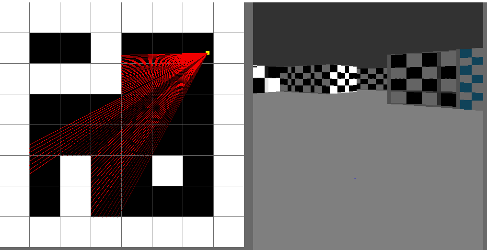
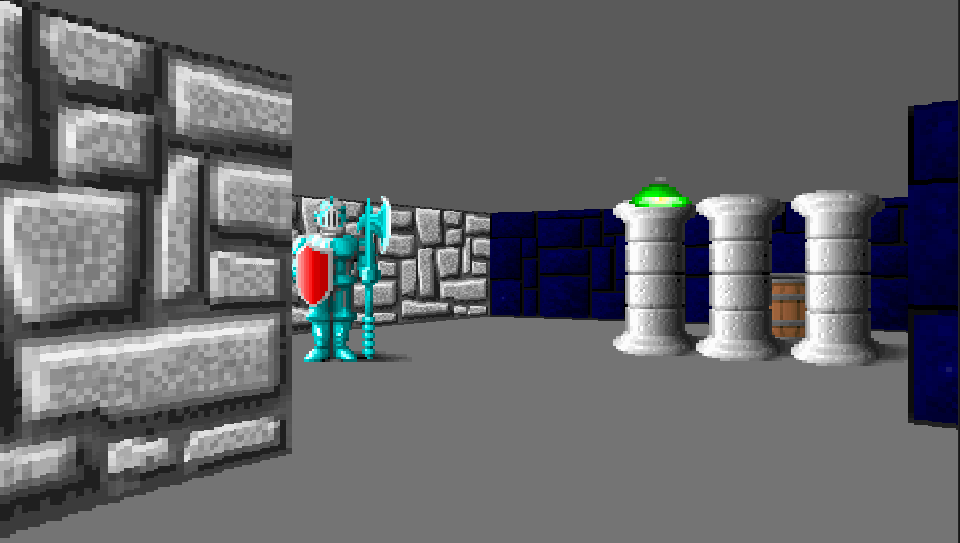

# A Raycaster in SDL

## Raycaster with textures

 

 

   I made this small raycasting engine as a way to learn SDL and also some graphical computing, currently it serves as a pseudo Wolfenstein3D clone

   **THIS ENGINE IS IN DEVELOPMENT**, 
   I am currently working on optimizing and adding features to the engine

## Features
   - [ ] Fully textured 64x64 walls
   - [ ] Textured Sprites, static, dynamic and directional
   - [ ] Full colisions for sprites and walls
   - [ ] Smooth keyboard and mouse camera movement

## Todo
   - [ ] Floor and ceiling textures (Performance heavy)
   - [ ] Proper doors
   - [ ] Gameplay(??)

## References
Alot of the code was direct reference from 3DSage's youtube series on raycasters
 - [Make your own Raycaster Part 1](https://www.youtube.com/watch?v=gYRrGTC7GtA)
    - by [3DSage](https://www.youtube.com/c/3DSage)

SDL initialization and event handling from LazyFoo's tutorials
   - [SDL Tutorials](https://lazyfoo.net/tutorials/SDL/)

Getting my head around concepts was much easier with this tutorial
 - [Lode's Computer Graphics tutorials](https://lodev.org/cgtutor/index.html)

Alot of the math was derived from this video
 - [Wolfenstein 3D's map renderer](https://www.youtube.com/watch?v=eOCQfxRQ2pY&list=WL&index=124)
    - by [Matt Godbolt](https://www.youtube.com/c/MattGodbolt)

