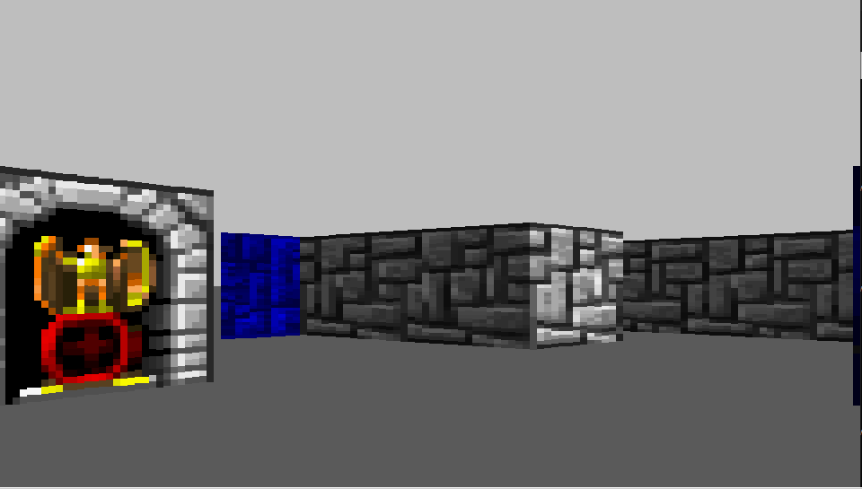

# A Raycaster in SDL

## Raycaster with textures

 

 
   I made this small raycasting engine as a way to learn SDL and also some graphical computing

   **THIS ENGINE IS IN DEVELOPMENT**, 
   I am currently working on optimizing and revamping the engine to be more efficient

## Todo
   - [ ] Floor and ceiling textures
   - [ ] Sprites
   - [ ] Improve mouse movement

## Reference
Alot of the code was direct reference from 3DSage's youtube series on raycasters
 - [Make your own Raycaster Part 1](https://www.youtube.com/watch?v=gYRrGTC7GtA)
    - by [3DSage](https://www.youtube.com/c/3DSage)

Alot of the math was derived from this video
 - [Wolfenstein 3D's map renderer](https://www.youtube.com/watch?v=eOCQfxRQ2pY&list=WL&index=124)
    - by [Matt Godbolt](https://www.youtube.com/c/MattGodbolt)

SDL initialization and event handling from LazyFoo's tutorials
   -[SDL Tutorials](https://lazyfoo.net/tutorials/SDL/)

